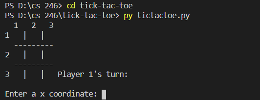

## Overview
This program allows two people to play tic tac toe as many times as they like. This demostrates my ability to use loops and conditionals as well as list and functions.

### Enviorment:
I used visual studio code with python and git downloaded

##### Running the Program:
I simpy inputed "ticktactoe.py" into the terminal and it displaye the results.

##### Screenshot:

##### Helpful Websites: 
I found w3school.com to be extremely helpful, escpecially their pages on Functions and List.
https://www.w3schools.com/python/python_lists.asp
https://www.w3schools.com/python/python_functions.asp
